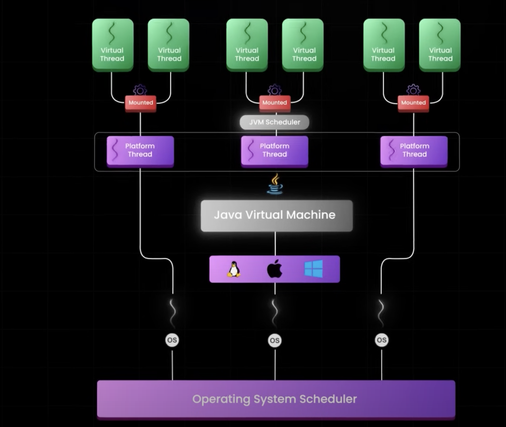

# Getting Started

### Concurrency before Java 21

* **Complex error handling:** If one task fails, we must manually cancel the other task. Otherwise, it will continue running despite no longer being required, leading to resource leakage.
* **Thread lifecycle management:** You are responsible for the entire lifecycle of the threads.
* **Exception propagation:** Checked exceptions tend to get wrapped awkwardly.
* **No guarantee of cleanup:** If the main thread exits unexpectedly, tasks might continue running.

### Concurrency in Java 25

* **Guaranteed cleanup:** Tasks cannot outlive their scope.
* **Clear ownership:** Tasks belong to a specific scope.
* **Exception safety:** Failures are handled consistently.
* **Resource management:** No thread pool management needed.
* **Composability:** Scopes can be nested and combined.

# Different approach to processing items 

## 1.Batch processing

A Spring Batch component Job has one too many Steps, each of which has one ItemReader for reading the data from 
the database or file, an ItemProcessor for modifying the read data from the file or database, and finally,
an ItemWriter for writing the processed record to the desired destination. 
A Job in the Spring Batch is launched with the JobLauncher, 
and metadata about the currently running process is found to be stored in JobRepository.

**Every item is processed one by one.**

 
**All item are processed for around 50sec.**

## 2.Async processing

**Items are processed as groups of 5 items simultaneously.
The first 5 items will be processed in parallel on our 5 platform threads defined in the thread pool.
And once each thread is released.**

**Thread pool executor e configure to create 5 thread simultaneously.
And that they are launched synchronously, one after the other.
Threads run Java code directly on an underlying operating system thread.**

**The same item are processed for around 11sec.**

## 3. VirtualThreadTaskExecutor

**VirtualThreadTaskExecutor create 50 virtual threads /we defined in NumberItemReader/, allowing to process all the 50 items in parallel at the same time.**

**Needed time to be proceeding all items is around 1 minutes and half.**

Explanation:
In previous test cases with simple batch processing and async used Platform thread. 
They are bounded directly to the OS system. Consume significant amount of memory /around 1MB per thread/. 
Platform are managed by OS scheduler.

Java introduce new way to manage synchronize processes by Virtual thread. 
They’re not directly connected to the OS, instead they’re managed by JVM scheduler. 
When Virtual thread is ready its get mounted on a platform thread /carried thread/. 
If Virtual thread has blocking operation JVM scheduler unmounted it from Platform thread. 
When is completed with the blocking operation Virtual threads is unmount from Platform thread.
Each Virtual Thread can be associated with multiple Platform Threads during its lifetime — one at a time though.
If you think about the Virtual Thread executing many CPU operations, these may be executed by different Carrier Threads.
Below the Platform threads, we have OS threads. These are managed by OS system. 
Each Platform threads is managed by one of these OS threads. 
OS doesn’t know for the exciting of virtual threads.

**Downside:**

*Platform threads:*
- In a JVM, only a fixed number of Platform Threads can be created. The number of Platform Threads that can be created 
    in a JVM will ultimately depend on the memory associated with the JVM as well as the Operating System.
    Because of that they're expensive resource.

*Virtual threads:*

 - calling external web-services, it might become a problem if we send more calls simultaneously than they can handle.

**Advantage:**

- Virtual thread as a Thread with the advantage that during IO operation it will not hold on to important resources. 
The IO operation could be file handling, socket read/write, locking and so on. 
The application will end up using Platform Threads (in the form of Carrier Threads) ONLY during CPU operations. 
During the IO operations, the Carrier Threads are released and free to be used by other users.
- improves the scalability /because Carrier Threads/
- lightweight