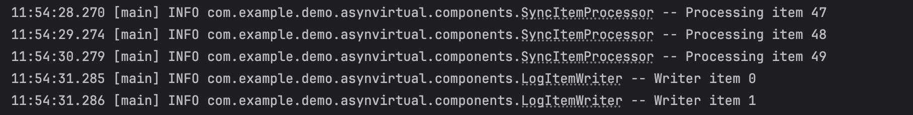

# Getting Started

### Concurrency before Java 21

* **Complex error handling:** If one task fails, we must manually cancel the other task. Otherwise, it will continue running despite no longer being required, leading to resource leakage.
* **Thread lifecycle management:** You are responsible for the entire lifecycle of the threads.
* **Exception propagation:** Checked exceptions tend to get wrapped awkwardly.
* **No guarantee of cleanup:** If the main thread exits unexpectedly, tasks might continue running.

### Concurrency in Java 25

* **Guaranteed cleanup:** Tasks cannot outlive their scope.
* **Clear ownership:** Tasks belong to a specific scope.
* **Exception safety:** Failures are handled consistently.
* **Resource management:** No thread pool management needed.
* **Composability:** Scopes can be nested and combined.

# Different approach to processing items 

## 1.Batch processing

A Spring Batch component Job has one too many Steps, each of which has one ItemReader for reading the data from 
the database or file, an ItemProcessor for modifying the read data from the file or database, and finally,
an ItemWriter for writing the processed record to the desired destination. 
A Job in the Spring Batch is launched with the JobLauncher, 
and metadata about the currently running process is found to be stored in JobRepository.

**Every item is processed one by one.**

 
**All item are processed for around 50sec.**

